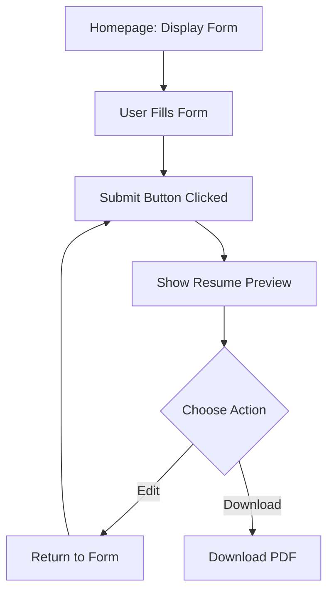

# Resume Builder WebApp Plan

## Features
- Input personal details, education, experience
- Preview
- Edit

## Components
- Header
- Footer
- Form
- Section
- FormField
- Button
- Preview

## Form Section

### About
- Name
- Email
- Phone
- Summary
### Education
- Institution Name
- Degree/Course
- Graduation Date (Date Picker)
### Experience
- Company Name
- Position
- Description
- Start Date
- End Date

## UX Flow

